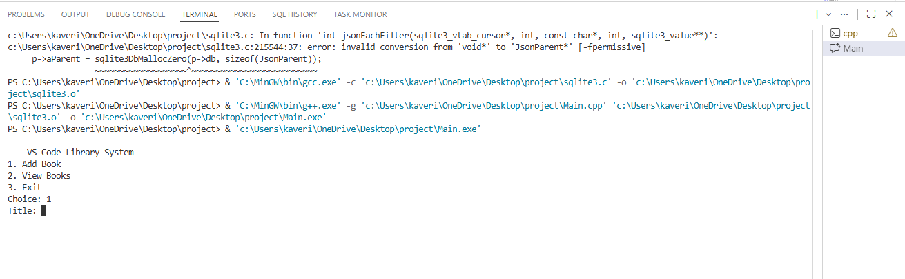
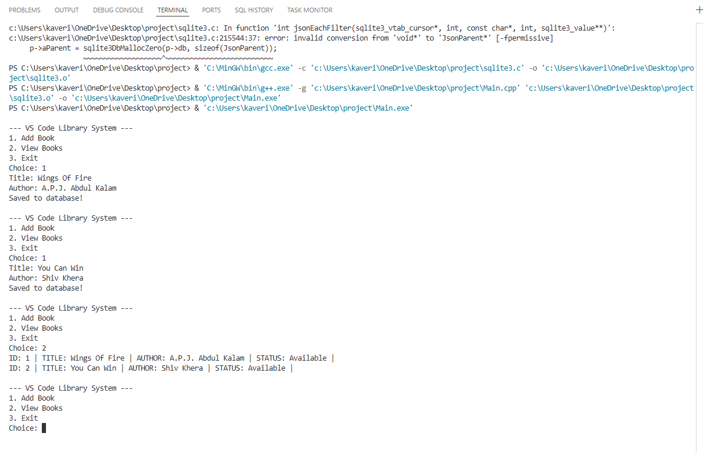
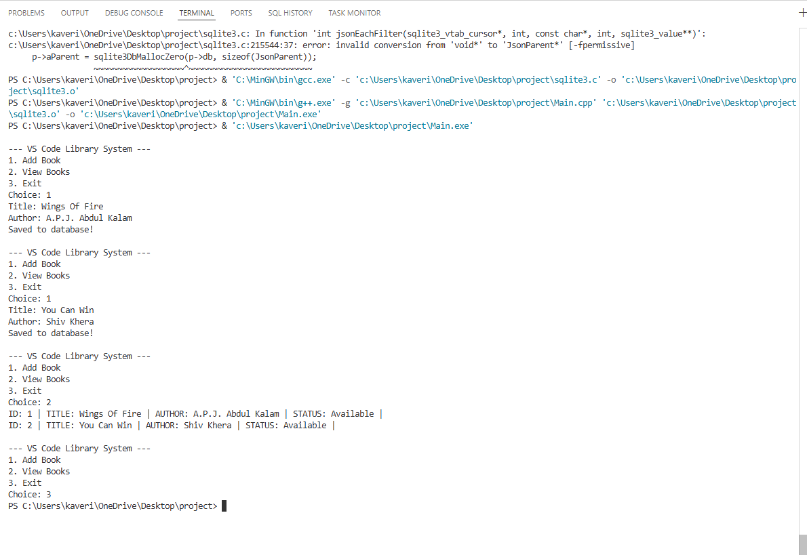

# Library-Management
A simple console-based Library Management System written in C++ using SQLite for persistent storage.
This project demonstrates basic database operations such as creating tables, inserting records, and reading data — all from a C++ program.

Features :

Automatically creates a local SQLite database (library.db)

Creates a BOOKS table if it doesn’t already exist

Add new books (Title & Author)

View all stored books

Simple menu-driven interface

Persistent data storage using SQLite

 Tech Stack

C++

SQLite3

VS Code (recommended IDE)

 Database Structure :

Table: BOOKS

Column	Type	Description
ID	INTEGER	Primary key (Auto Increment)
TITLE	TEXT	Book title (Required)
AUTHOR	TEXT	Author name (Required)
STATUS	TEXT	Book status (Default: Available)
 Setup & Installation
1️⃣Install SQLite

Make sure SQLite is installed on your system.

Windows:
Download from the SQLite official site and add it to your PATH.

Linux / macOS:

sudo apt install sqlite3 libsqlite3-dev

or

brew install sqlite

2️⃣ Compile the Program

Use a C++ compiler like g++:

g++ main.cpp -o library -lsqlite3

Make sure sqlite3.h and the SQLite library are properly linked.

3️⃣ Run the Program
./library

A file named library.db will be created automatically in the project folder.

🧭 How to Use

Once the program starts, you’ll see a menu:

1. Add Book
2. View Books
3. Exit

➕ Add Book

Enter the book title

Enter the author name

The book is saved to the database

📖 View Books

Displays all books stored in the database with their details

❌ Exit

Safely closes the database and exits the program

 Notes

This project uses raw SQL queries (no prepared statements).

User input is not sanitized (for learning/demo purposes).

Suitable for beginners learning C++ + SQLite integration.

## 📸 Screenshots

### Main Menu

### Add Book

### View Books

